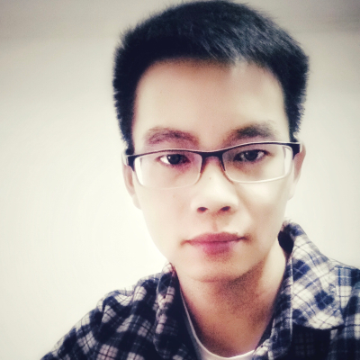

## About Me

Hi! I am a Ph.D. student of Computer Architecture at Wuhan National Laboratory for Optoelectronics, Huazhong University of Science & Technology, China.

## Research Interest

Magnetic Recording, Signal Processing in Communication, Information Theory and Coding Technology, and Machine Learning

## Publications

1. **Ke Luo**, Shaobing Wang, Kheong Sann Chan, Wei Chen, Jincai Chen, Ping Lu, Weiming Cheng. *A Study on Block-Based Neural Network Equalization in TDMR System With LDPC Coding.* IEEE Transactions on Magnetics, v55, n11, p6700605 (5 pp.), Nov. 2019

2. Shaobing Wang, Jincai Chen, **Ke Luo**, Guoqiang Xie; Ping Lu; Weiming Cheng. *Joint Four-Reader Array Equalization and Detection for a Single Track in TDMR.* IEEE Transactions on Magnetics, v55, n12, p3002006 (6 pp.), Dec. 2019

3. Jincai Chen, Guoqiang Xie, **Ke Luo**, Shaobing Wang, Ping Lu, Yao Wang. *Study of erase band and write performance for shingled magnetic recording with FePt-based exchanged coupled composite media.* IEEE Transactions on Magnetics, v54, n11, p7100306 (6 pp.), Nov. 2018

4. **Ke Luo**, Shaobing Wang, Guoqiang Xie, Jincai Chen, Ping Lu, Weiming Cheng. *Read Channel Modeling and Neural Network Block Predictor for TDMR.* 2018 Asia-Pacific Magnetic Recording Conference (APMRC), 2018

5. Guoqiang Xie, **Ke Luo**, Shaobing Wang, Ping Lu, Weiming Cheng, Jincai Chen. *Rounded Corner Effect on Write Performance for Shingled Magnetic Recording System.* 2018 Asia-Pacific Magnetic Recording Conference (APMRC), 2018

## Related Projects
* 超高密度二维磁记录读磁头阵列及其记录系统关键技术研究. NSFC No.61672246. (2017.1~2020.12)
* 比特图案介质的超高密度瓦记录关键技术研究. NSFC No.61272068. (2013.1~2016.12)

